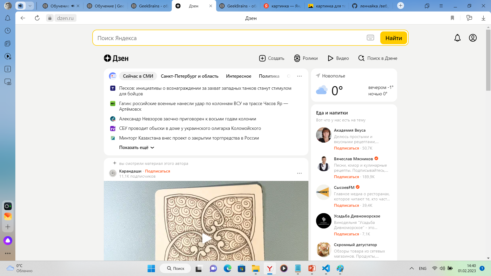
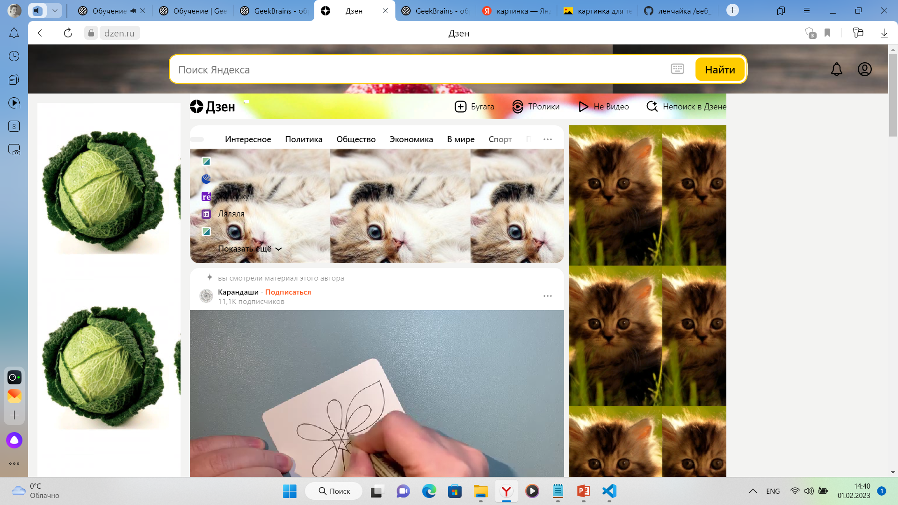

 *домашнее задание:*

  на основе сайта **dzen.ru**:

 1. Определите, на каком протоколе работает сайт.
 2. Внесите не менее 8 изменений на страницу с помощью 
 инструмента разработчика и представьте скриншоты было/стало.

 **Решение**
 1. https
 2. 
    
    